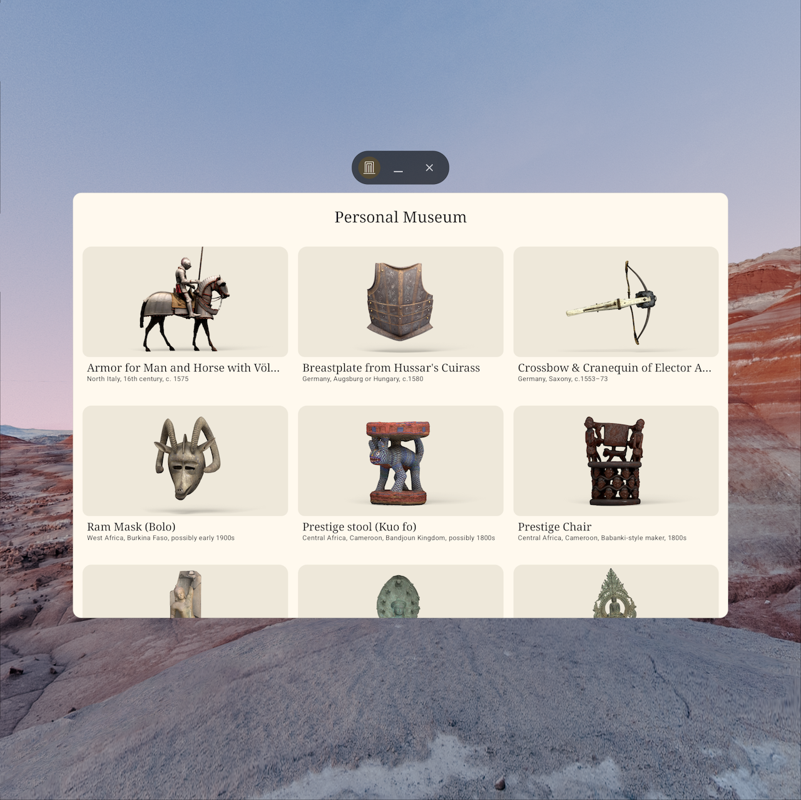
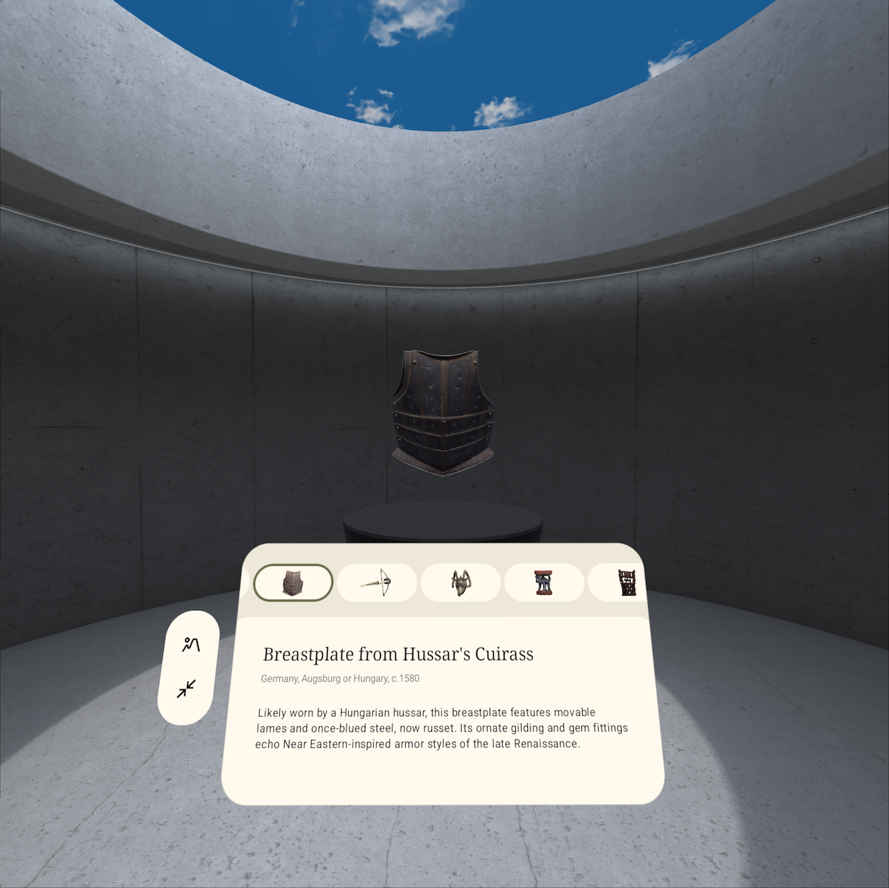
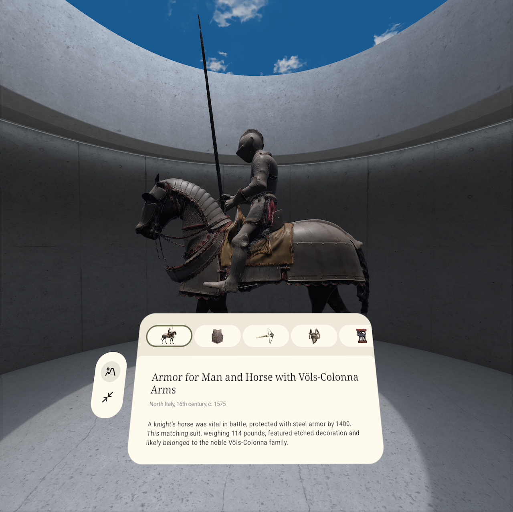

# Personal Museum

The personal museum application demonstrates Android XR capabilities using the Jetpack Compose XR library and ARCore. It allows users to explore art items in a home screen view, then view related 3D models and detail information in a fullscreen mode. A museum mode is also available for an enhanced immersive experience.

For more information, please read the documentation at https://developer.android.com/develop/xr

# Screenshots

# Features

This experiment demonstrates:
- Building 3D UI elements with Jetpack Compose for XR library including Subspace and SpatialPanel
- Building 2D UI elements and related animations with Jetpack Compose
- Loading and manipulating GLTF models in 3d space
- Custom interactions with 3d entities
- Immersive spatial environments for the XR experience

## Building 3D UI elements
In full-screen mode, the Android XR app employed Subspace and SpatialPanel from the Jetpack Compose XR library. These components served as the base for displaying 2D UI elements containing art information in 3D space, enabling users to navigate between different artworks and enter or exit museum mode.
## Loading and manipulating GLTF models
Individual artwork 3D models are loaded as GltfModelEntity instances and added to the scene graph. For different 3D models, the same entity is reused but updated with new Pose, translation positions, and scale.
## Custom 3d Object Interaction
An interaction handler is implemented allowing users to be able to rotate 3D objects around the Y-axis by acting as an executor for the InteractableComponent.
## Immersive Spatial Environments
Demonstrated enabling and disabling a custom spatial environment using a pre-loaded GLTF model as geometry.

# Development Environment and Requirements
Android XR Experiment uses the Gradle build system and can be imported directly into Android Studio (make sure you are using the latest stable version available here).

# Additional Resources
https://developer.android.com/xr
https://developer.android.com/develop/xr
https://developer.android.com/design/ui/xr

# License
Android XR experiments are distributed under the terms of the Apache License, Version 2.0 (the "License"); You may not use this file except in compliance with the License.
You may obtain a copy of the License at

    https://www.apache.org/licenses/LICENSE-2.0

Unless required by applicable law or agreed to in writing, software
distributed under the License is distributed on an "AS IS" BASIS,
WITHOUT WARRANTIES OR CONDITIONS OF ANY KIND, either express or implied.
See the License for the specific language governing permissions and
limitations under the License.
