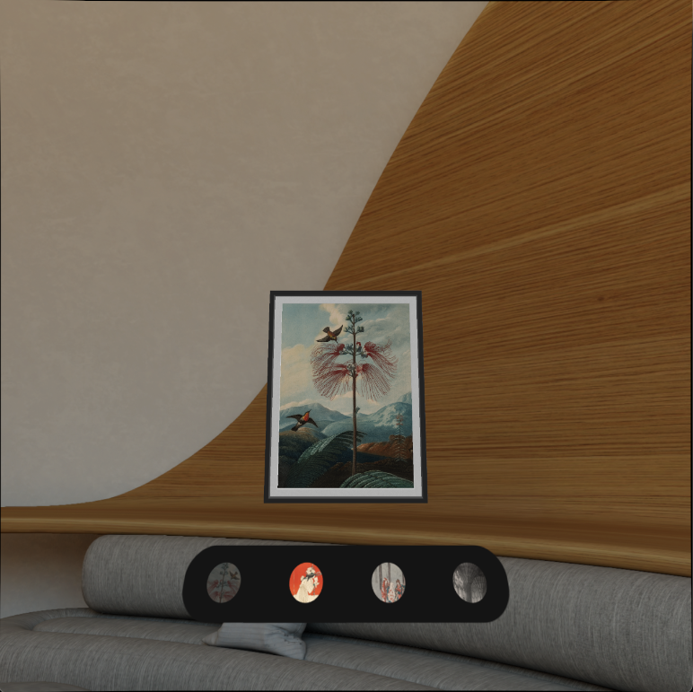
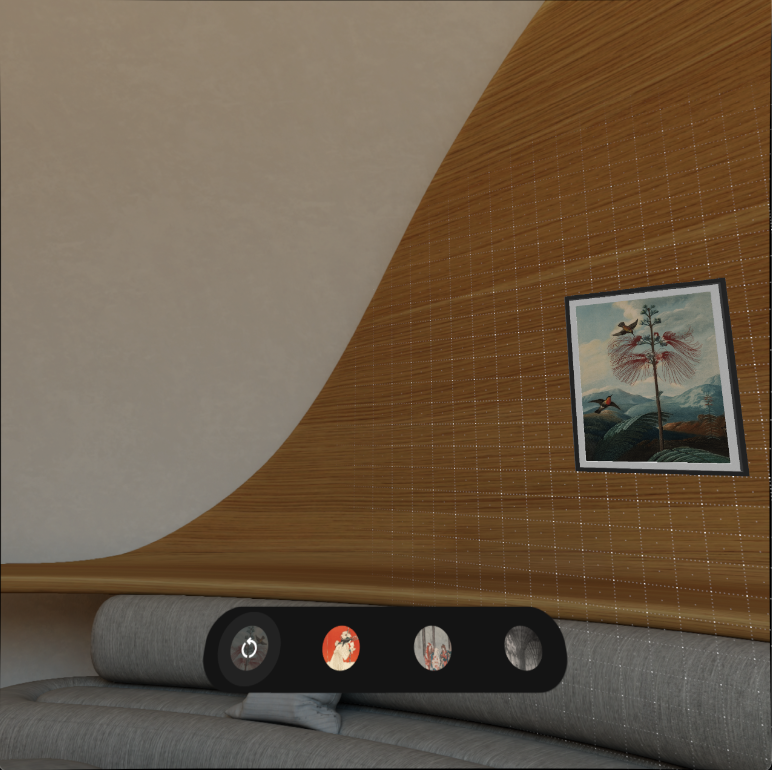
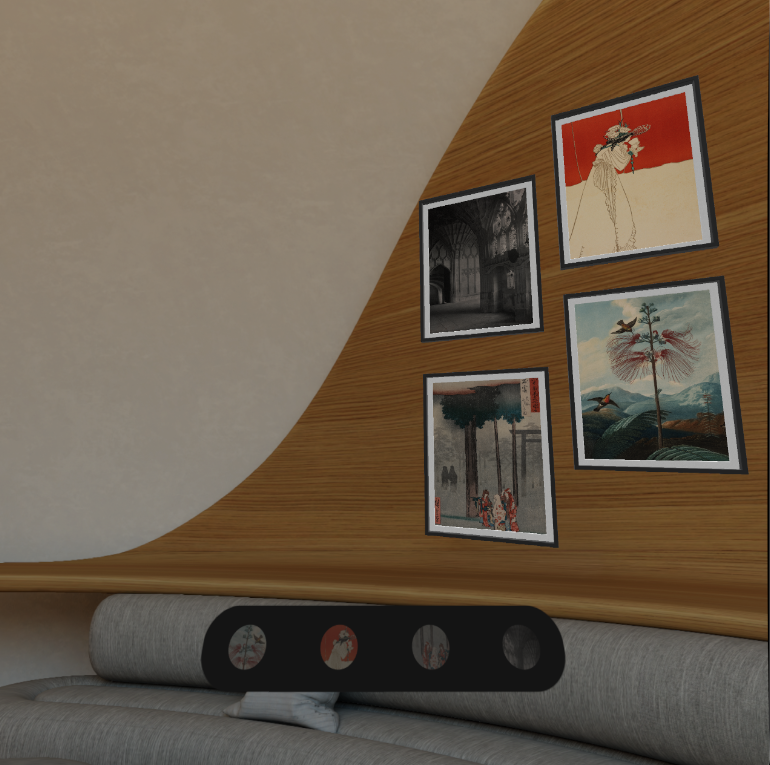

# **Photo Wall**

This experiment is built with the Jetpack XR SDK, showcasing the capabilities of Android XR. It allows instantiating a framed photo (GltfModelEntity) from the menu. As photos are interacted with (dragged) in the scene, a preview is shown if the photo can be snapped to a wall.

## Photo Wall showcases:

* Dynamic UI using Composables
* Head-tracked UI (simulating body-tracking)
* Gltf model loading and interaction
* ARCore plane detection and filtering
* ARCore Anchors

For more information, please [read the documentation](https://developer.android.com/develop/xr).

## **Screenshots**

## **Features**

- ### **Simulated Body-Tracking UI**

    Simulated body-tracking is a modified version of head-tracked UI. With body-tracking, the UI is only repositioned when the head pose exceeds a specified threshold. This allows the user to look around the environment while the UI stays stationary. If the UI is out of range, it smoothly repositions in front of the user.

- ### **ARCore Plane Detection and Filtering**

    As photos are interacted with (dragged) in the scene, a hitTest is performed against all Trackables. The Trackables are then filtered to determine if the pointer ray intersects with a Wall plane. If an intersecting Wall plane is found, the photo is previewed in the wall-snapped pose.

- ### **ARCore Anchors**

    If a dragged photo is placed on a wall plane, an anchor is created for that entity. This anchor allows the photo to maintain its position relative to the real-world environment \- even if the activity space and perception space diverge.

## **Development Environment and Requirements**

Android XR Experiment uses the Gradle build system and can be imported directly into Android Studio (make sure you are using the latest stable version available [here](https://developer.android.com/studio)).

## **Additional Resources**

* [https://developer.android.com/xr](https://developer.android.com/xr)
* [https://developer.android.com/develop/xr](https://developer.android.com/develop/xr)
* [https://developer.android.com/design/ui/xr](https://developer.android.com/design/ui/xr)

### **License**

Android XR experiments are distributed under the terms of the Apache License, Version 2.0 (the "License"); You may not use this file except in compliance with the License.  
You may obtain a copy of the License at

    https://www.apache.org/licenses/LICENSE-2.0

Unless required by applicable law or agreed to in writing, software  
distributed under the License is distributed on an "AS IS" BASIS,  
WITHOUT WARRANTIES OR CONDITIONS OF ANY KIND, either express or implied.  
See the License for the specific language governing permissions and  
limitations under the License.
