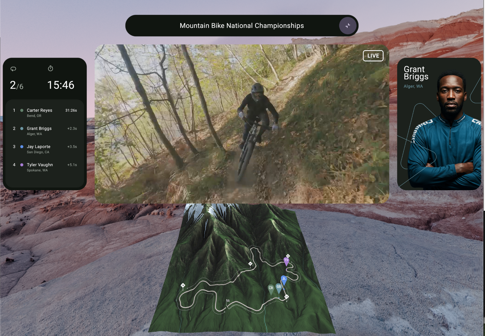

# Sports Companion

This repository contains an Android Studio project that provides a straightforward example of the
basic functionality afforded to Android apps in Android XR.

For more information, please [read the documentation](https://developer.android.com/develop/xr).

# Features

In the sample you can see an implementation of:

- Full Space vs Home Space Content
- 3D Model
- 3D Model interaction
- Playing videos with ExoPlayer

# 💻 Development Environment

**Sports Companion App** uses the Gradle build system and can be imported directly into Android Studio
(make sure you are using the latest stable version available
[here](https://developer.android.com/studio)).

# Additional Resources

- https://developer.android.com/xr
- https://developer.android.com/develop/xr
- https://developer.android.com/design/ui/xr

# License

**Sports Companion App** is distributed under the terms of the Apache License (Version 2.0). See the
[license](LICENSE) for more information.
